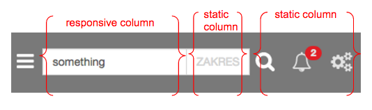

## static-columns

# Static Columns for Angular2+

Columns with static width mixed with responsive columns are 
not a problem anymore!

How to install:
```
    npm install static-columns --save
```


Import it:
```ts
    import { StaticColumnsModule } form "static-columns/browser"
  // or for angular aot
    import { StaticColumnsModule } form "static-columns/browser/angular"


```

Put inside directives array:
```ts
    // ...
    imports: [StaticColumnsModule]
    // ...
```
Example:
	
```html
    <columns-container>
        <column grow >
    	  // responsive columns
          // you also create nested container like this
      </column>
       <column width="190">                        
           // static column here
       </column>
     </columns-container>
```




