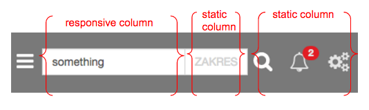

# STATIC-COLUMNS - effortless Angular2+ layouts

# forget about flex box complicated rules !

With this simple library 

**angular / html columns with static width**

mixed with
 
**columns with responsive width**
 
are not a problem anymore!


---
### How to install:
```
    npm install static-columns --save
```


### Import it:
```ts
import { StaticColumnsModule } form "static-columns/browser"
```

### Put module inside angular imports:
```ts

@NgModule(
 // ... 
  imports: [StaticColumnsModule]
  // ... 
)
class MyExampleModule {
 // ... 
}
```

# Examples
	
 ## Basic usage:
```html
<columns-container>
  <column grow > <!-- this column will grow/shring based on screen width -->
    something
  </column>
  <column width="50"> <!-- 50px -->                     
      <button>ZAKRES</button>
  </column>
  <column width="190"><!--190px-->                                             
      <button-magnifier></button-magnifier>
      <button-bell></button-bell>
      <button-gears></button-gears>
  </column>
</columns-container>
```



